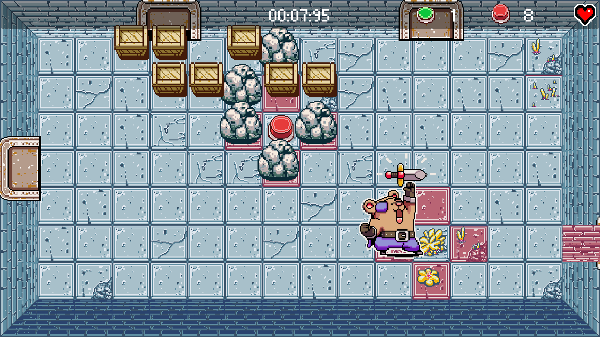
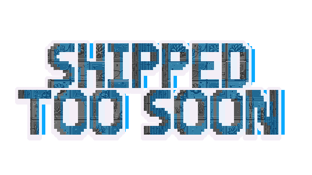
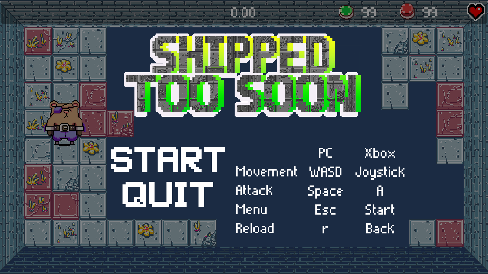
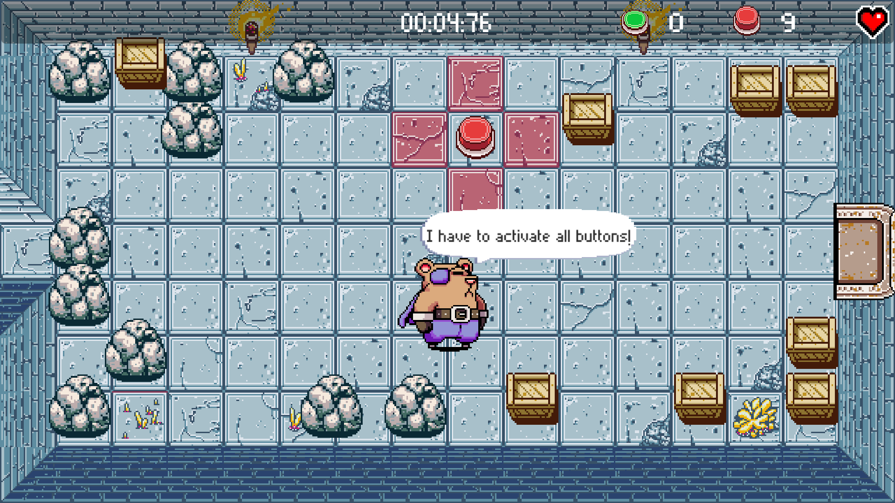
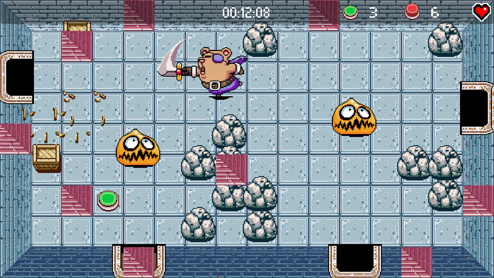
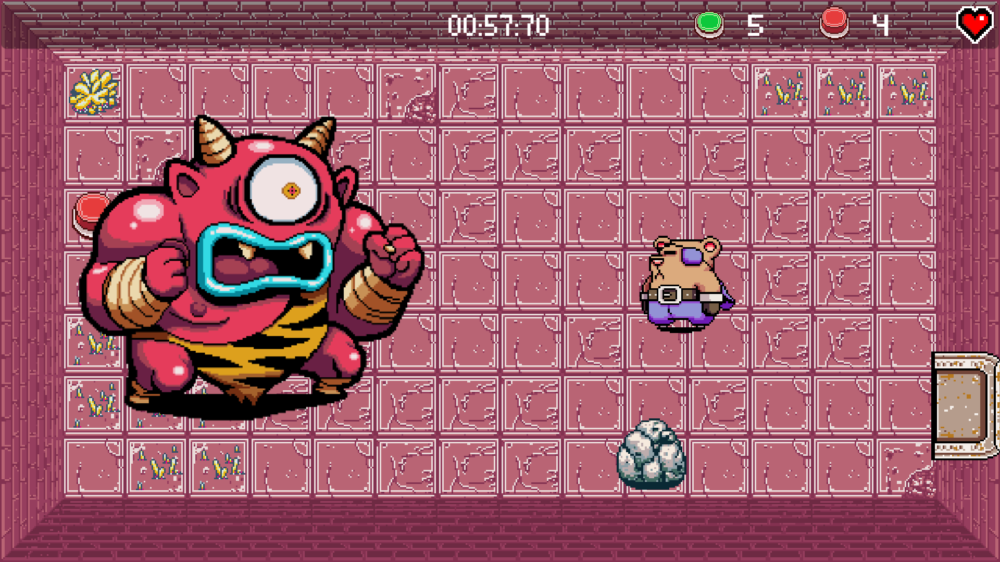

# Shipped Too Soon

`Shipped Too Soon` is a 2D Top-Down Single Player Dungeon Crawler done in Unity.
It was originally developed under 48h during the Montreal McGameJam 2018.
The theme was "This isn't even my final form!".
This is the final version after several bug fix and cleanup.
The goal is to activate all buttons (One per room) as fast as you can.

## Synopsis

    The Name of the Game was "Bearing Arms"
    It should have been an easy game to ship
    A Dungeon Crawler starring a cute character
    A Zelda rippoff, really...
    But the Team got ambitious
    And, in the end, the game got...

## Controls

| Name | PC | Xbox Controller |
| ----- | ----- | ----- |
| Movement | WASD | Joystick |
| Attack | Space | A |
| Back to menu | Escape | Start |
| Reload level | R | Back |

## Unity Development

- Unity version 2017.4.10f1
- Sound design made with Wwise

## Screenshots

## Authors

- Matthieu Godet (artist)
- Pierre Hayeur (level design)
- Constantin Masson (programmer)
- Frédéric Lévesque (programmer)
- Max Romain (audio)
